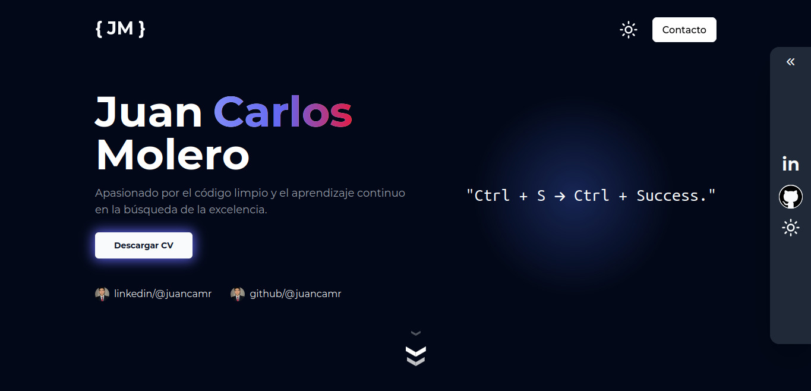

# Portafolio Web

¡Bienvenido a mi portafolio web!

Este repositorio contiene el código fuente de mi sitio web personal, donde presento información sobre mí, mis proyectos y habilidades.

## Contenido

- [Vista previa](#vista-previa)
- [Características](#características)
- [Tecnologías utilizadas](#tecnologías-utilizadas)
- [Cómo ejecutar localmente](#cómo-ejecutar-localmente)

## Vista previa

[Enlace a mi portafolio web](https://portafolio-juancamr.vercel.app)

## Características

- Página de inicio con información personal.
- Sección de proyectos destacados.
- Detalles de cada proyecto con enlaces y descripciones.
- Lenguajes y tecnologías que domino.
- Sección de contacto con información para conectarse.

## Tecnologías utilizadas

- CSS
- React
- NextJS
- JavaScript

## Cómo ejecutar localmente

1. Clona este repositorio: `git clone https://github.com/tu-usuario/tu-repositorio.git`
2. Navega al directorio del proyecto: `cd tu-repositorio`
3. Instala las dependencias necesarias: `bun install`
